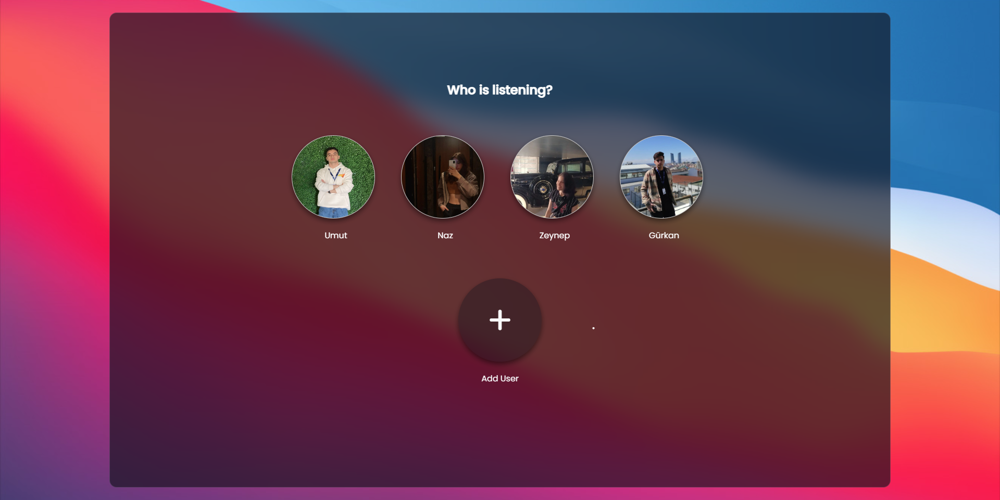

# Harmony Hub
### EN
## About
#### Harmony Hub was created as a project with the purpose of improving the design of existing music providers and allowing a developer to enhance their coding skills. This music website embarked on the goal of enhancing the user interface and design of current music providers.

#### Harmony Hub offers several innovative features to make the developer's music experience more user-friendly and maximize their enjoyment of music. The main objective of this project is to provide music enthusiasts with access to expansive music libraries from different providers and enhance their music exploration experience.

#### Furthermore, Harmony Hub provides an opportunity for the developer to enhance their coding skills and experiment with new technologies. This project serves as a platform for the developer to showcase their abilities and improve themselves in the field of music.

#### Harmony Hub is an innovative project that aims to provide music lovers with a unique music experience. With its user-friendly interface, vast music library, and personalized features, it strives to meet the needs of users and offer them an enjoyable music experience.

[Review the project](https://main--stellar-lebkuchen-e43024.netlify.app/index.html)

### TR

## Hakkında
#### Harmony Hub, müzik sağlayıcılarının tasarımının beğenilmemesi ve bir geliştiricinin kod yazma becerilerini geliştirmek amacıyla oluşturulan bir proje olarak hayata geçirildi. Bu müzik sitesi, mevcut müzik sağlayıcılarının kullanıcı arayüzü ve tasarımını iyileştirme hedefiyle yola çıktı.

#### Harmony Hub, geliştiricinin müzik deneyimini daha kullanıcı dostu hale getirmek ve müzik keyfini en üst düzeye çıkarmak için birçok yenilikçi özellik sunar. Bu projenin temel amacı, müzik severlere farklı sağlayıcılardaki geniş müzik kütüphanelerine erişim sağlama imkanı sunmak ve kullanıcıların müzik keşfetme deneyimini geliştirmektir.

#### Bunun yanı sıra, Harmony Hub geliştiricinin kendi kod yazma becerilerini geliştirmek ve yeni teknolojileri deneyimlemek için bir fırsat sunar. Bu proje, geliştiricinin yeteneklerini sergilemesi ve müzik alanında kendini geliştirmesi için bir platform sağlar.

[Projeyi İnceleyin](https://main--stellar-lebkuchen-e43024.netlify.app/index.html]

## Screenshots

## My Social Media Accounts
## [Linkedin](https://www.linkedin.com/in/umut-yavuz-732106255/) - [Patika.dev](https://app.patika.dev/realbaymayan)
